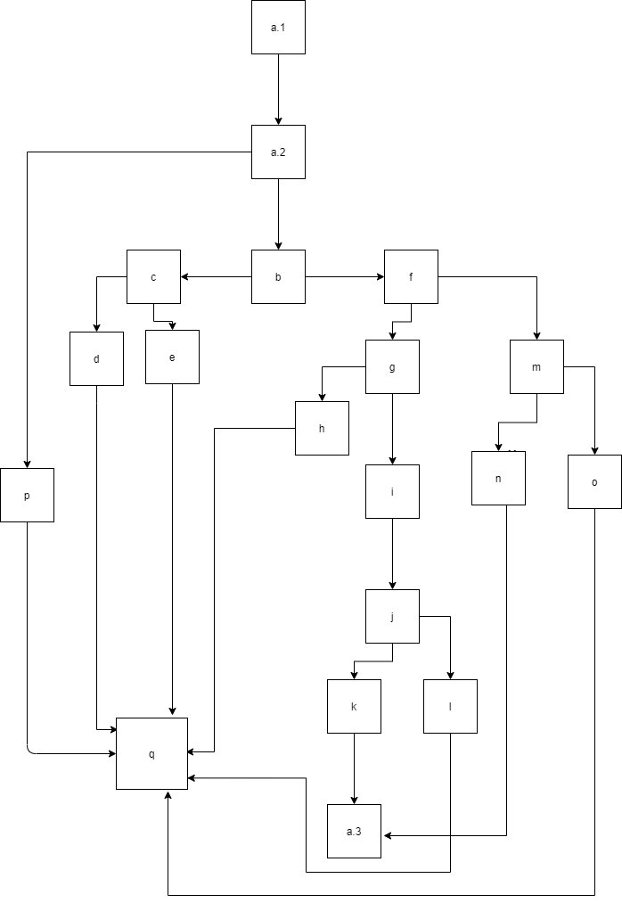

# Sl_lab02_193107
Control Flow graph

Цикломатската комплексност на процесот е 8 и истата ја добиваме со формулата Е-N+2,каде што Е-број на ребра и N-број на јазли.Во случајов имаме 19 јазли и 25 ребра. 
